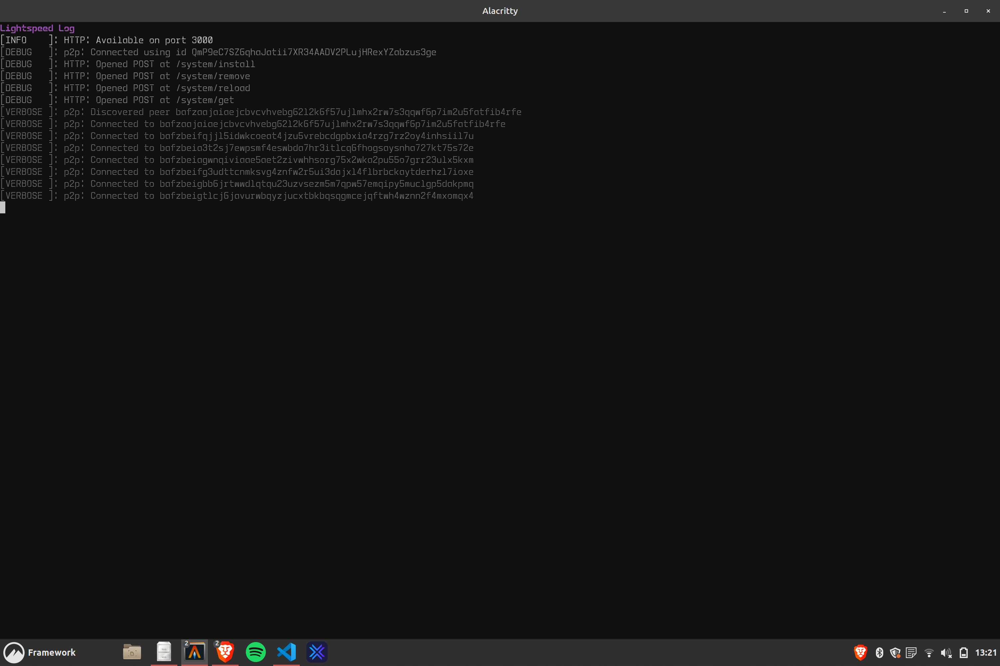

<br/>
<p align="center">
  <a href="https://github.com/lsfoundation/js-node">
    
  </a>

  <h3 align="center">Javascript Lightspeed Core</h3>

  <p align="center">
    currently in development
    <br/>
    <br/>
    <a href="https://github.com/lgtspd/js-core/issues">Report Bug</a>
    -
    <a href="https://github.com/lgtspd/js-core/issues">Request Feature</a>
  </p>
</p>

  

## Table Of Contents

- [About the Project](#about-the-project)
- [Getting Started](#getting-started)
  - [Prerequisites](#prerequisites)
  - [Installation](#installation)
- [Usage](#usage)
- [Roadmap](#roadmap)
- [Contributing](#contributing)
- [License](https://github.com/lsfoundation/js-node/blob/main/LICENSE.md)
- [Authors](#authors)

## About The Project



This is the official Javascript implementation the Lightspeed core. It leverages Javascript's JIT compiler to dynamically un/load modules, allowing for network modification and even hopping in real time.

## Getting Started

Getting started with the core is quick and easy in order to maximize usability. Follow the steps below to get a local node running in a few minutes.

### Prerequisites

- NodeJS

### Installation and Usage

#### From Source

1. Clone the repo & change directories

```sh
git clone https://github.com/lgtspd/js-core.git && cd js-core
```

2. Install NPM packages

```sh
npm install --save-dev
```

3. Run the local node

```sh
# Local Test Network
npm test
```
## Roadmap

See the [open issues](https://github.com/lsfoundation/js-node/issues) for a list of proposed features (and known issues).

## Contributing

Contributions are what make the open source community such an amazing place to be learn, inspire, and create. Any contributions you make are **greatly appreciated**.

- If you have suggestions for adding or removing projects, feel free to [open an issue](https://github.com/lsfoundation/js-node/issues/new) to discuss it, or directly create a pull request after you edit the _README.md_ file with necessary changes.
- Please make sure you check your spelling and grammar.
- Create individual PR for each suggestion.
- Please also read through the [Code Of Conduct](https://github.com/lsfoundation/js-node/blob/main/CODE_OF_CONDUCT.md) before posting your first idea as well.

### Creating A Pull Request

1. Fork the Project
2. Create your Feature Branch (`git checkout -b feature/AmazingFeature`)
3. Commit your Changes (`git commit -m 'Add some AmazingFeature'`)
4. Push to the Branch (`git push origin feature/AmazingFeature`)
5. Open a Pull Request

## Authors

- [**Mason Coles**](https://github.com/ixkdo/) - _Lead Developer, Founder_